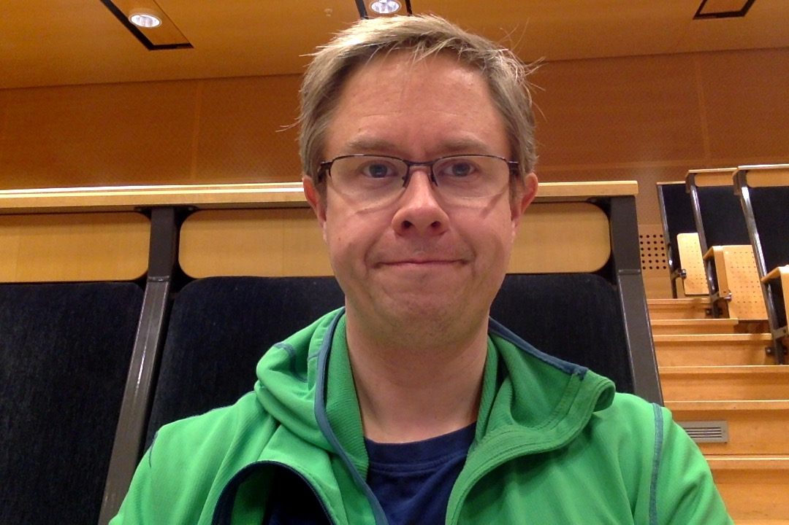

# Dagbok för Erik Melander

OSPP (1DT096) 2016 - Grupp 3

Gör en kort anteckning i dagboken under aktuell vecka och dag nedan
varje gång du arbetat på projektet.

## Vecka 15

##### Måndag

##### Tisdag

##### Onsdag

##### Torsdag

##### Fredag

## Vecka 16

##### Måndag
Gruppmöte, gruppkontrakt och reflektion av presentationen.

##### Tisdag
Läste på om Golang och webbservrar. Skrev min del i medlemmar.md och den här dagboken.

##### Onsdag
Peer review av andras projektförslag. Fipplat med golang webserver. Möte med Karl.

##### Torsdag
Minimalt med golang testande.

##### Fredag
Läste på mer om webstandarder och fixat med emacs och gitrepon.

#### Lördag
Konfigurerade emacs ännu mer. Testade att starta en webbserver med go. Testade ladda upp och ner filer.
## Vecka 17

##### Måndag
Satt med Joel och diskuterade igenom de olika lösningar för webbserver vi kollat på under förra veckan. Diskuterade github-struktur.

##### Tisdag
Gruppmöte. Uppdaterade Projektplan, diskuterade inför onsdagens gruppmöte.

##### Onsdag
Möte med gruppen och sedan möte med de andra grupperna och Karl. Satt
och skissade på serverarkitektur på kvällen.

##### Torsdag
Möte med gruppen där systemarkitektur på servern och interface diskuterades. Nästa vecka planlades.

##### Fredag

## Vecka 18

##### Måndag
Parprogrammering av server.go med Joel. Fokus på att skapa md5 hask när man får en GET request.

##### Tisdag
Mer parprogrammering. Fokus på att skapa och hålla koll på kanalerna som ska skapas till supervisor rutinerna.

##### Onsdag
Mer parprogrammering. Löst concurrencyproblem med kanal map:en (med mutex...). Fösta testerna skrivna. Funderade lite på godoc.

##### Torsdag

##### Fredag
Testade GET och POST requests för att se om det vi gjort hittills funkade. Började kolla på skapandet av foldrar.

##### Lördag
Lite diskussion med Joel om uppdelning i packages

##### Söndag
Fixade en fake configurering. Fixade så att foldrar kontrolleras och skapas. Mer snack med Joel om paketstruktur.
## Vecka 19

##### Måndag
Satt med Joel och gick igenom vad vi gjort. La till hantering av JSON payload. Pull request för get-post branchen vi jobbat på. Fixade diverse buggar som upptäcktes när Johan och Jonas testade vår branch. Satt och funderade lite på download.

##### Tisdag
Fixade slides till milstolpe 2 mötet och parkodade med Joel, parsning av url vid download map hash och fil. Testade så vi kunde ladda ner en fil vi laddat upp. Man måste veta vad den heter och hashen dock. Installerade golang 1.6 för att kunna testa Gorilla webtoolkit ifall vi vill använda websockets.

##### Onsdag
Gruppmöte för att gå igenom inför presentationen för milstolpe 2. Milstolpe 2 möte. Planerade gruppens arbete för resten av veckan. Satt och parkodade med Joel för att få JSON avkodningen och dess datatyp att funka.

##### Torsdag

##### Fredag
Möte med Joel och Ali. Planering. Fixade några refaktoreringsbuggar. Började skapa nya struktar för filarean.

##### Lördag

##### Söndag
Skrev supervisor channel structar och reply strucktar samt ändrade så att dessa används.

## Vecka 20

##### Måndag
Merge av det Joel arbetat på i supervisor branch med min channel branch. Parkodade med Joel upload supervisor och download supervisor. Skrev download supervisor hjälpfunktioner för att ändra i filstruktarna. Skrev lite test och dokumentation.

##### Tisdag

##### Onsdag

##### Torsdag

##### Fredag

## Vecka 21

##### Måndag

##### Tisdag

##### Onsdag

##### Torsdag

##### Fredag

## Vecka 22

##### Måndag

##### Tisdag

##### Onsdag

##### Torsdag

##### Fredag
