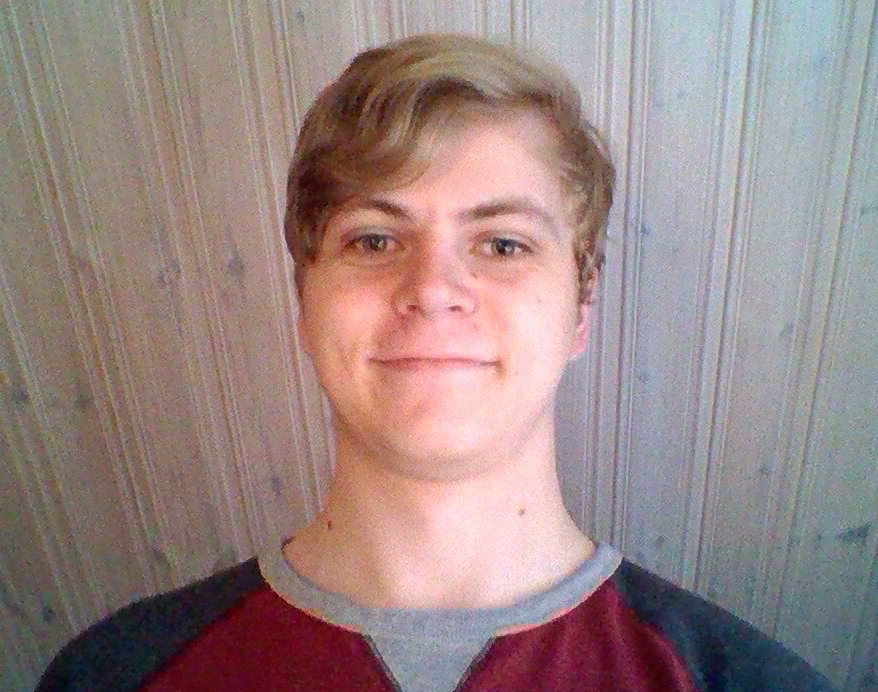

# Dagbok för Joel Wallin

OSPP (1DT096) 2016 - Grupp 3

## Vecka 15

##### Måndag, 12:00 - 13:15
Brainstorming och diskussion om projektförslag i grupp.

##### Tisdag, 09:15 - 13:00
Vi beslutade om vilket projekt vi skulle göra och inledde arbetet med det skriftliga och muntliga projektförslaget.

##### Onsdag, 12:00 - 13:15
Fortsatt arbete i grupp med både det skriftliga och muntliga projektförslaget.

##### Torsdag 09:30 - 12:00
Gjorde klart alla slides och förberedde oss för presentationen.

##### Fredag, 20 min
Finslip av det skriftliga projektförslaget och lämnade in den.

## Vecka 16

##### Måndag, 12:00 - 16:00
Fixade gruppkontrakt, presentation av medlemmar samt dagbok på Github.

##### Tisdag

##### Onsdag 14:00 - 15:30
Peer review av andra gruppers projektförslag samt allmän diskussion om systemarkitektur och design.

##### Torsdag

##### Fredag

## Vecka 17

##### Måndag, 16:00-19:00
Läste på om webbserverar i Go.

##### Tisdag

##### Onsdag, 11:30-14:00
Jag och Erik disskuterade vad vi hade lärt oss om webbserver teknologier i Go. Samt arbete inför milstolpe 1.

##### Torsdag, 10:00-12:00
Möte inför milstolpe 1 och planering.

##### Fredag, 15:00-16:00
Snabbt möte fölt av milstolpe 1.

#### Lördag, 09:00-10:30
Möte via slack där vi definierade systemarkitekturen bättre samt interface mellan front- och back-end.

## Vecka 18

##### Måndag, 13:00-16:00
Delade initialt upp arbetet för backend, jag och Erik började fila på servern och upload funktionaliteten. Fokus hamnade på att skapa en md5 hash vid en GET request till servern.

##### Tisdag, 13:30-16:30
Parprogrammering med Erik, fortsatt arbete från igår. Skapade även en datastruktur för kanaler till supervisor rutiner.

##### Onsdag, 13:15-16:15
Parprogrammering med Erik, fortsatt arbete från igår samt tester skrivna i Go.

##### Torsdag

##### Fredag, 16:00-19:00
Experimenterade med godoc samt http tester.

##### Lördag, ?-?
Mest snack med erik om uppdelning i paket och lite almänt om servern.

##### Söndag, 16:00-18:00
Skrev bättre tester och omstrukturering av kod och mappar.

## Vecka 19

##### Måndag, 12:00-16:00
Parprogrammering med Erik. Fixade json och försökte få till någon vettig dokumentering. Gjode pull-request till master.

##### Tisdag, 12:00-16:00
Parprogrammering med Erik. Började definiera download funktionaliteten för servern. Samt fixade slides inför milstolpe 2.

##### Onsdag, 09:15-16:00
Gruppmöte inför milstolpe 2. Även parprogrammering med Erik där vi fortsatte med json kodning/avkodning och att parsa URLer. Gruppen gjorde även en primär planering för denna vecka.

##### Torsdag

##### Fredag

## Vecka 20

##### Måndag

##### Tisdag

##### Onsdag

##### Torsdag

##### Fredag

## Vecka 21

##### Måndag

##### Tisdag

##### Onsdag

##### Torsdag

##### Fredag

## Vecka 22

##### Måndag

##### Tisdag

##### Onsdag

##### Torsdag

##### Fredag
