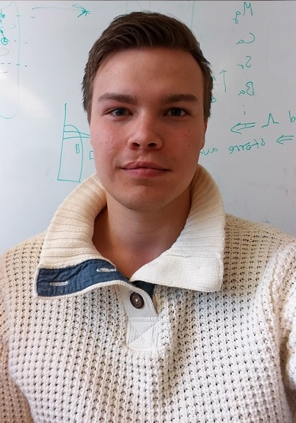

# Medlemmar

OSPP (1DT096) 2016 - Grupp 03

> För att lärarna på kursen skall kunna följa och bedöma era arbetsinsatser är det viktigt att vi vet vem som är vem vid till exempel muntliga presentationer och andra möten. 

> Tag foton av alla medlemmar i gruppen. Varje foto skall visa
> personen framifrån från axlarna och uppåt. Spara bilderna i mappen
> `/meta/images/`.

> Fyll sedan i tabellen nedan. Tabellen skall vara sorterad på förnamn.

Bild                                       | Förnamn               | Efternamn | Personnummer | Användarnamn (Github)
-------------------------------------------|-----------------------|-----------|--------------|----------------------
   | [Ali](#alikocholo)    | Shojaeddin| 950404-8696  | `alikocholo`
 | [André](#anle3295)    | Le Blanc  | 9109303850   |	`anle3295`
  | [Erik](#erikun)	   | Melander  | 771028-8577  | `erikun`
  | [Joel](#M34ris)	   | Wallin    | 9411233134   |	`M34ris`
 | [Johan](#Tallkotten)  | Lejdung   | 930914-3254  | `Tallkotten`
 | [Jonas](#Revyy)       | Olander   | 910503-5795  | `Revyy`

> Utgå sedan från mallen nedan och skapa ett avsnitt för varje medlem
i gruppen sorterade i bokstavsordning  

## Ali Shojaeddin

### Okänd talang

- I like to learn about the basics of a new programming language. I also take great interest in learning about the basics of developing a complex program. In my spare time I like to watch TV series and/or play games. Making video games in programming languages I learn is a goal of mine.

### Starka sidor

- I believe I am very good at writing reports and specifications in English. 
- I am very communicative and I like to initiate group meetings quite often. 

### Personlig utveckling

- My goal in this project is to develop as much knowledge as possible on devloping a program in a different language with specifications and features that we have decided on.

## André Le Blanc

### Okänd talang

- Grym på att hugga ved och slå gräs med lie.

### Starka sidor

- Grym på att producera under crunch time. 
- Kommer på snabba algoritmer.

### Personlig utveckling

- Lära mig göra ett större projekt.
- Göra något webbaserat för första gången.
- Lära mig golang

## Erik Melander

### Okänd talang
Spelat go (brädspelet).

### Starka sidor
- Gillar problemlösning och att jaga buggar.
- Bra på att läsa på och söka information.

### Personlig utveckling

- Lära sig client/server tänkande.
- Tillämpa det vi lärt oss om concurrency programmering.
- Lära sig Golang.

## Joel Wallin

### Okänd talang

- Kan lösa en 4x4x4 rubiks kub på 5 minuter.
- Hög tolerans för stark mat.

### Starka sidor

- Att lösa olika matematiska- och programmeringsproblem.
- Arbete i grupp och se till så att samarbetet fungerar.
- Hitta information för att kunna lösa problem.
- Att skriva rapporter av olika slag och form.

## Personlig Utveckling

- Jag kopierar Johans mål att lära sig skriva tydliga specifikationer.
- Go programmering, bland annat bli mer bekant med dess concurrency model.
- Muntliga presentationer är min svagaste sida, framförallt mitt kroppsspråk (då jag ofta har armarna i kors) och engagemang med publiken.

## Johan Lejdung

### Okänd talang

Jag gillar att utveckla och komma på nya idéer samt att koda på projekt (främst webb).
Dessutom så gillar jag att hålla mig någolunda hälsosam genom besök på gym och/eller springturer i naturen.
Film, serier och spel dominerar mitt behov för underhållning. När jag arbetar lyssnar jag gärna på lung "musik" alt naturljud.

### Starka sidor

- **problemlösning och algoritmer**
	Jag är duktig på att hitta lösningar på problem och tror jag kan bidra med detta.
- **skriva kod utifrån färdig specifikation**
	Det är något jag har erfarenhet av och kommer definitivt klara av igen
- **planering**
	Jag älskar att planera och skapa "påminnelser"
- **samarbete & ledarskap**
	Jag har arbetat i grupp tidigare (arbetsmiljö) och har erfarenhet av detta. Jag tenderar även att fylla ledarrollen om behovet finns.
- **research (söka och sammanställa information)**
	Utöver planering så gillar jag att vara påläst, därför kommer att jag se till och göra research på eventuella problem innan jag implemnterar lösning.
- **muntlig presentation**
	Jag har inga problem att prata inför folk och fann senaste presentationen ganska rolig och utmanande. Ser fram emot att göra det igen.
- **Client & server**
	Har erfarenhet inom detta område och kommer att kunna bidra med kunskap vi behöver i början av projektet.

### Personlig utveckling

Under projektet hoppas jag förutom att bli ännu bättre på mina redan
starka sidor även ges möjlighet att utveckla följande färdigheter,
till exempel:

- **analys/design/specifikation**
	Jag vill lära mig mer om att skriva tydliga specifikationer
- **programmeringsspråket go**
	Jag hoppas kunna lära mig mer om Go, det verkar väldigt intressant
- **'frameworket' React**
	Jag har skrivit i javascript tidigare men detta framework verkar väldigt intressant och användbart
- **In this project I am to develop my programming skills by learning about the Go programming language.**
	Min dokumentation är oftast utförlig men följer inget 'gränssnitt' så detta vill jag bli bättre på.
- **rapportskrivande**
	Det är alltid kul när man får ihopp en fint skriven rapport

## Jonas Olander

### Okänd talang

Netflix

### Starka sidor

- programmering

Har en del tidigare erfarenhet inom det område vi valt att lägga projektet inom.

- problemlösning och algoritmer

Problemlösning är något jag alltid gillat och anser mig vara kapabel att tänka "outside of the box" vid behov.

- planering
 
Jag gillar att planera mitt arbete i förväg och tror att jag kan bidra med min goda organisationsförmåga.

- ledarskap
 
Det brukar bli så att jag tar lite av en ledar-roll under projektarbeten men har inga problem med att ta ett steg tillbaka om någon annan har en bra idè. 

- research (söka och sammanställa information)
 
Har lätt för att fokusera på en specifik uppgift och anser mig själv vara bra på att hitta information.

- muntlig presentation

Tycker att presentationen är en viktig del av projektet och ser gärna att den blir så bra som möjligt.

### Personlig utveckling

- scrum

Vill gärna få en större inblick i hur scrum fungerar.

- muntlig presentation

Muntliga presentationer är något som jag vill träna ännu mer på även om jag känner mig hyffsat säker redan.

